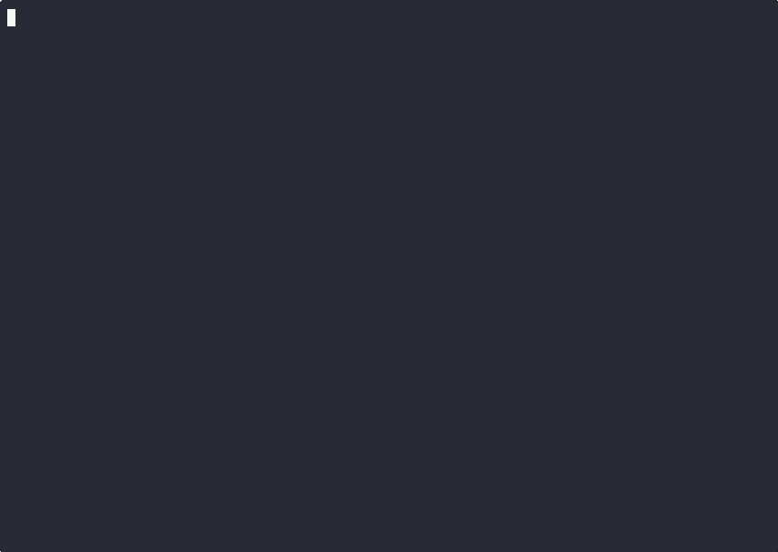

# motion-base

[](https://github.com/TLCFEM/motion-base/actions/workflows/master.yml)
[](https://codecov.io/gh/TLCFEM/motion-base)
[](https://hub.docker.com/r/tlcfem/motion-base)
[](https://hub.docker.com/r/tlcfem/motion-base)

`motion-base` aims to provide a unified entry point for accessing and processing ground motion
records from different national databases.

It comes with a web interface and a Python client that can be used to access the data programmatically.

> [!IMPORTANT]
> **Check out the [demo](https://mb.tlcfem.top/) site.**


## Main Functionalities

- [x] Parse and index ground motion records from different databases in a uniform format.
- [x] Search and select ground motion records based on different criteria, including magnitude, PGA, event time, event location, etc.
- [x] Provide ad hoc processing, including up-/down-sampling, normalization, filtering and computation of response spectra.
- [x] Provide standard machine-readable format for the processed data and a programmatic interface to allow further processing in large scale.
- [x] Convert acceleration record to velocity/displacement record that is consistent with specific time integration methods.

Potential use cases include:

1. seismology statistical analysis,
2. structural dynamics analysis,
3. uncertainty quantification,
4. artificial ground motion generation,
5. machine learning applications,
6. many others.

> [!IMPORTANT]
> **Collaboration in any form at various levels is welcome.**

## Quick Start

Please ensure `docker`, `curl`, and `jq` are installed on the system.
The following command will download the `example.sh` script and execute it.
It will pull the images and deploys a local instance of the application.
It then uploads the example data to the application.

```bash
curl -s https://raw.githubusercontent.com/TLCFEM/motion-base/refs/heads/master/scripts/example.sh -o example.sh && bash example.sh
```

Please always check the content of the script (especially from the Internet) before executing it.
The following is a walkthrough of the script.

[<p align="center"></p>](https://asciinema.org/a/FYpQv4PFufAEArqzWBOyodzeQ)
