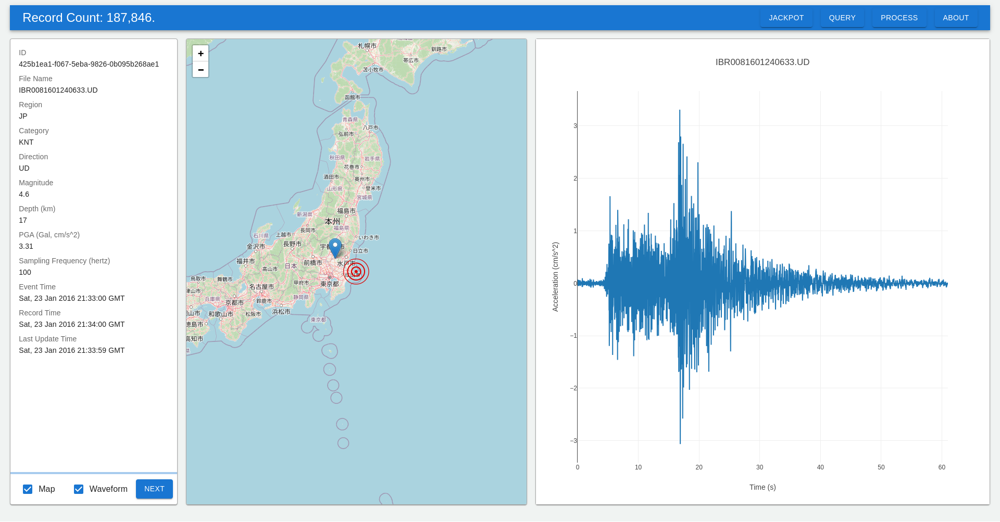

# Summary

`motion-base` is a ground motion database designed to provide a unified entry point for accessing and processing ground
motion records from various national databases.
It includes a web interface and a Python client for programmatic access.
The main functionalities include parsing and indexing ground motion records, allowing searches based on different
criteria, and providing ad hoc processing such as up-/down-sampling, normalization, filtering, and computation of
response spectra.
This software is particularly useful for researchers and engineers in earthquake engineering and seismology, offering a
streamlined and standardized approach to handle ground motion data efficiently.

# Statement of need

The [PEER Ground Motion Database](https://ngawest2.berkeley.edu/site) (USA) offers a simple search interface that allows
users to search for ground motion records based on a few parameters such as magnitude, fault type, etc.
The search has a limit of 100 records per query and the records can be downloaded in a plain text format.

The [NIED](https://www.kyoshin.bosai.go.jp/kyoshin/data/index_en.html) (Japan) also provides a database with a similar
search interface.
After logging in, one can download records in a plain text format.

The [NZSM](https://data.geonet.org.nz/seismic-products/strong-motion/volume-products/) (New Zealand) provides public
access to a complete collection of their strong motion data.
But there is no search interface that can be used to filter records based on certain criteria.

The plain text formats used by these databases are not identical, each has slight differences compared to the others.
The raw data acquired from these databases are not machine-readable and require manual processing to extract the
necessary information.

This makes it difficult for researchers and engineers to perform large-scale analyses on ground motion records from
different databases.
It would be beneficial to have a FAIR [@Wilkinson2016] facility that provides a unified platform for accessing and
processing ground motion records for various applications in earthquake engineering and seismology.

# Overview

`motion-base` is designed to address this need.
The raw data obtained from different databases can be fed to the parsers, which will extract the metadata and the time
series records and store them in a standardized JSON-based format.
The records are indexed and stored in [MongoDB](https://www.mongodb.com/) that offers flexible querying capabilities.

The parsed records can be further processed, common operations include

1. up-/down-sampling and filtering using digital signal processing techniques,
2. computing frequency spectra using the Fourier transform,
3. computing response spectra using the algorithm by @Lee1990.

Compared to the aforementioned databases, in which response spectra are pre-computed with fixed parameters, all these
operations are performed on the raw data on-the-fly with `motion-base`, making it easy to perform ad-hoc analyses on the
records.
Researchers and engineers can flexibly adjust the parameters of the processing steps to suit their needs.

\autoref{fig:overview} shows the landing page of the web interface.



# Deployment

`motion-base` can be deployed on UNIX-like systems.
For the purpose of illustration, the following commands will create an example deployment on a local machine.

```bash
git clone --depth 1 --branch master https://github.com/TLCFEM/motion-base.git
bash motion-base/scripts/example.sh
```

# References