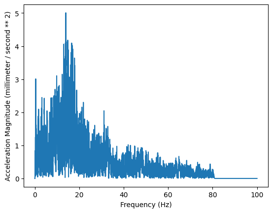
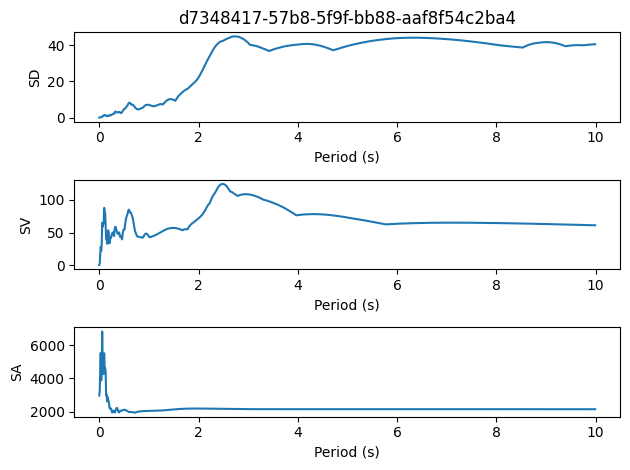

# The Client

The web interface presents a nice and simple way to browse records.
But it is not convenient for programmatic usage.

A Python client is also provided to interact with the server.

Currently, the package is not published to PyPI.
To use the client, one shall clone the repository and install the package locally.

```bash
git clone https://github.com/TLCFEM/motion-base.git
cd motion-base
pip install .[client]
```

Then one can import the client and start using it.

## Creation

The client is designed in an asynchronous way, using the `aiohttp` library.
One shall use the context manager to create a client.

Additional parameters may include:

1. `timeout(float)` - request timeout
2. `semaphore(int)` - number of concurrent requests

```python
async with MBClient('http://localhost:8000', timeout=20, semaphore=10) as client:
    # do something with the client
    ...
```


```python
from rich.pretty import pprint

from mb.client import MBClient
```


## Query

To query the server, one shall use the `search` method.
The method accepts a query configuration object.
The configuration(s) are `pydantic` models.
For example, to search for 100 records with PGA no less than 200 Gal, one can do the following.


```python
from mb.app.response import PaginationConfig, QueryConfig

async with MBClient("http://170.64.176.26:8000", timeout=20, semaphore=10) as client:
    results = await client.search(
        QueryConfig(min_pga=200, pagination=PaginationConfig(page_size=100))
    )
    pprint(f"Find {len(results)} records. The first one contains looks like this.")
    pprint(results[0])
```


<pre style="white-space:pre;overflow-x:auto;line-height:normal;font-family:Menlo,'DejaVu Sans Mono',consolas,'Courier New',monospace"><span style="color: #008000; text-decoration-color: #008000">'Find 100 records. The first one contains looks like this.'</span>
</pre>


<pre style="white-space:pre;overflow-x:auto;line-height:normal;font-family:Menlo,'DejaVu Sans Mono',consolas,'Courier New',monospace"><span style="color: #800080; text-decoration-color: #800080; font-weight: bold">MBRecord</span><span style="font-weight: bold">(</span>
<span style="color: #7fbf7f; text-decoration-color: #7fbf7f">│   </span><span style="color: #808000; text-decoration-color: #808000">endpoint</span>=<span style="color: #008000; text-decoration-color: #008000">'/query'</span>,
<span style="color: #7fbf7f; text-decoration-color: #7fbf7f">│   </span><span style="color: #808000; text-decoration-color: #808000">id</span>=<span style="color: #008000; text-decoration-color: #008000">'d7348417-57b8-5f9f-bb88-aaf8f54c2ba4'</span>,
<span style="color: #7fbf7f; text-decoration-color: #7fbf7f">│   </span><span style="color: #808000; text-decoration-color: #808000">file_name</span>=<span style="color: #008000; text-decoration-color: #008000">'20161113_110259_WTMC_20.V2A'</span>,
<span style="color: #7fbf7f; text-decoration-color: #7fbf7f">│   </span><span style="color: #808000; text-decoration-color: #808000">category</span>=<span style="color: #008000; text-decoration-color: #008000">'processed'</span>,
<span style="color: #7fbf7f; text-decoration-color: #7fbf7f">│   </span><span style="color: #808000; text-decoration-color: #808000">region</span>=<span style="color: #008000; text-decoration-color: #008000">'nz'</span>,
<span style="color: #7fbf7f; text-decoration-color: #7fbf7f">│   </span><span style="color: #808000; text-decoration-color: #808000">uploaded_by</span>=<span style="color: #008000; text-decoration-color: #008000">'d41eadf4-5770-5e2f-874f-0f18f543fd73'</span>,
<span style="color: #7fbf7f; text-decoration-color: #7fbf7f">│   </span><span style="color: #808000; text-decoration-color: #808000">magnitude</span>=<span style="color: #008080; text-decoration-color: #008080; font-weight: bold">7.53</span>,
<span style="color: #7fbf7f; text-decoration-color: #7fbf7f">│   </span><span style="color: #808000; text-decoration-color: #808000">maximum_acceleration</span>=<span style="color: #008080; text-decoration-color: #008080; font-weight: bold">2969.75</span>,
<span style="color: #7fbf7f; text-decoration-color: #7fbf7f">│   </span><span style="color: #808000; text-decoration-color: #808000">event_time</span>=<span style="color: #800080; text-decoration-color: #800080; font-weight: bold">datetime</span><span style="color: #800080; text-decoration-color: #800080; font-weight: bold">.datetime</span><span style="font-weight: bold">(</span><span style="color: #008080; text-decoration-color: #008080; font-weight: bold">2016</span>, <span style="color: #008080; text-decoration-color: #008080; font-weight: bold">11</span>, <span style="color: #008080; text-decoration-color: #008080; font-weight: bold">13</span>, <span style="color: #008080; text-decoration-color: #008080; font-weight: bold">11</span>, <span style="color: #008080; text-decoration-color: #008080; font-weight: bold">2</span>, <span style="color: #008080; text-decoration-color: #008080; font-weight: bold">56</span><span style="font-weight: bold">)</span>,
<span style="color: #7fbf7f; text-decoration-color: #7fbf7f">│   </span><span style="color: #808000; text-decoration-color: #808000">event_location</span>=<span style="font-weight: bold">[</span><span style="color: #008080; text-decoration-color: #008080; font-weight: bold">173.02</span>, <span style="color: #008080; text-decoration-color: #008080; font-weight: bold">-42.69</span><span style="font-weight: bold">]</span>,
<span style="color: #7fbf7f; text-decoration-color: #7fbf7f">│   </span><span style="color: #808000; text-decoration-color: #808000">depth</span>=<span style="color: #008080; text-decoration-color: #008080; font-weight: bold">15.0</span>,
<span style="color: #7fbf7f; text-decoration-color: #7fbf7f">│   </span><span style="color: #808000; text-decoration-color: #808000">station_code</span>=<span style="color: #008000; text-decoration-color: #008000">'WTMC'</span>,
<span style="color: #7fbf7f; text-decoration-color: #7fbf7f">│   </span><span style="color: #808000; text-decoration-color: #808000">station_location</span>=<span style="font-weight: bold">[</span><span style="color: #008080; text-decoration-color: #008080; font-weight: bold">173.054</span>, <span style="color: #008080; text-decoration-color: #008080; font-weight: bold">-42.619</span><span style="font-weight: bold">]</span>,
<span style="color: #7fbf7f; text-decoration-color: #7fbf7f">│   </span><span style="color: #808000; text-decoration-color: #808000">station_elevation</span>=<span style="color: #800080; text-decoration-color: #800080; font-style: italic">None</span>,
<span style="color: #7fbf7f; text-decoration-color: #7fbf7f">│   </span><span style="color: #808000; text-decoration-color: #808000">station_elevation_unit</span>=<span style="color: #800080; text-decoration-color: #800080; font-style: italic">None</span>,
<span style="color: #7fbf7f; text-decoration-color: #7fbf7f">│   </span><span style="color: #808000; text-decoration-color: #808000">record_time</span>=<span style="color: #800080; text-decoration-color: #800080; font-weight: bold">datetime</span><span style="color: #800080; text-decoration-color: #800080; font-weight: bold">.datetime</span><span style="font-weight: bold">(</span><span style="color: #008080; text-decoration-color: #008080; font-weight: bold">2016</span>, <span style="color: #008080; text-decoration-color: #008080; font-weight: bold">11</span>, <span style="color: #008080; text-decoration-color: #008080; font-weight: bold">13</span>, <span style="color: #008080; text-decoration-color: #008080; font-weight: bold">11</span>, <span style="color: #008080; text-decoration-color: #008080; font-weight: bold">2</span>, <span style="color: #008080; text-decoration-color: #008080; font-weight: bold">19</span><span style="font-weight: bold">)</span>,
<span style="color: #7fbf7f; text-decoration-color: #7fbf7f">│   </span><span style="color: #808000; text-decoration-color: #808000">last_update_time</span>=<span style="color: #800080; text-decoration-color: #800080; font-weight: bold">datetime</span><span style="color: #800080; text-decoration-color: #800080; font-weight: bold">.datetime</span><span style="font-weight: bold">(</span><span style="color: #008080; text-decoration-color: #008080; font-weight: bold">2017</span>, <span style="color: #008080; text-decoration-color: #008080; font-weight: bold">1</span>, <span style="color: #008080; text-decoration-color: #008080; font-weight: bold">20</span>, <span style="color: #008080; text-decoration-color: #008080; font-weight: bold">11</span>, <span style="color: #008080; text-decoration-color: #008080; font-weight: bold">0</span><span style="font-weight: bold">)</span>,
<span style="color: #7fbf7f; text-decoration-color: #7fbf7f">│   </span><span style="color: #808000; text-decoration-color: #808000">sampling_frequency</span>=<span style="color: #008080; text-decoration-color: #008080; font-weight: bold">200.0</span>,
<span style="color: #7fbf7f; text-decoration-color: #7fbf7f">│   </span><span style="color: #808000; text-decoration-color: #808000">sampling_frequency_unit</span>=<span style="color: #008000; text-decoration-color: #008000">'hertz'</span>,
<span style="color: #7fbf7f; text-decoration-color: #7fbf7f">│   </span><span style="color: #808000; text-decoration-color: #808000">duration</span>=<span style="color: #008080; text-decoration-color: #008080; font-weight: bold">209.99</span>,
<span style="color: #7fbf7f; text-decoration-color: #7fbf7f">│   </span><span style="color: #808000; text-decoration-color: #808000">direction</span>=<span style="color: #008000; text-decoration-color: #008000">'UP'</span>,
<span style="color: #7fbf7f; text-decoration-color: #7fbf7f">│   </span><span style="color: #808000; text-decoration-color: #808000">scale_factor</span>=<span style="color: #008080; text-decoration-color: #008080; font-weight: bold">1e-05</span>,
<span style="color: #7fbf7f; text-decoration-color: #7fbf7f">│   </span><span style="color: #808000; text-decoration-color: #808000">raw_data</span>=<span style="color: #800080; text-decoration-color: #800080; font-style: italic">None</span>,
<span style="color: #7fbf7f; text-decoration-color: #7fbf7f">│   </span><span style="color: #808000; text-decoration-color: #808000">raw_data_unit</span>=<span style="color: #800080; text-decoration-color: #800080; font-style: italic">None</span>,
<span style="color: #7fbf7f; text-decoration-color: #7fbf7f">│   </span><span style="color: #808000; text-decoration-color: #808000">offset</span>=<span style="color: #800080; text-decoration-color: #800080; font-style: italic">None</span>,
<span style="color: #7fbf7f; text-decoration-color: #7fbf7f">│   </span><span style="color: #808000; text-decoration-color: #808000">processed_data_unit</span>=<span style="color: #800080; text-decoration-color: #800080; font-style: italic">None</span>,
<span style="color: #7fbf7f; text-decoration-color: #7fbf7f">│   </span><span style="color: #808000; text-decoration-color: #808000">time_interval</span>=<span style="color: #800080; text-decoration-color: #800080; font-style: italic">None</span>,
<span style="color: #7fbf7f; text-decoration-color: #7fbf7f">│   </span><span style="color: #808000; text-decoration-color: #808000">waveform</span>=<span style="color: #800080; text-decoration-color: #800080; font-style: italic">None</span>,
<span style="color: #7fbf7f; text-decoration-color: #7fbf7f">│   </span><span style="color: #808000; text-decoration-color: #808000">frequency_interval</span>=<span style="color: #800080; text-decoration-color: #800080; font-style: italic">None</span>,
<span style="color: #7fbf7f; text-decoration-color: #7fbf7f">│   </span><span style="color: #808000; text-decoration-color: #808000">spectrum</span>=<span style="color: #800080; text-decoration-color: #800080; font-style: italic">None</span>,
<span style="color: #7fbf7f; text-decoration-color: #7fbf7f">│   </span><span style="color: #808000; text-decoration-color: #808000">period</span>=<span style="color: #800080; text-decoration-color: #800080; font-style: italic">None</span>,
<span style="color: #7fbf7f; text-decoration-color: #7fbf7f">│   </span><span style="color: #808000; text-decoration-color: #808000">displacement_spectrum</span>=<span style="color: #800080; text-decoration-color: #800080; font-style: italic">None</span>,
<span style="color: #7fbf7f; text-decoration-color: #7fbf7f">│   </span><span style="color: #808000; text-decoration-color: #808000">velocity_spectrum</span>=<span style="color: #800080; text-decoration-color: #800080; font-style: italic">None</span>,
<span style="color: #7fbf7f; text-decoration-color: #7fbf7f">│   </span><span style="color: #808000; text-decoration-color: #808000">acceleration_spectrum</span>=<span style="color: #800080; text-decoration-color: #800080; font-style: italic">None</span>
<span style="font-weight: bold">)</span>
</pre>


A list of `MBRecord` objects will be returned.
The search method only returns the metadata of the records.
As one may have observed, the `MBRecord` object does not contain the actual data.

More query parameters can be applied.
The actual amount of records returned may be less than the specified amount, if there are not enough records to return.


```python
async with MBClient("http://170.64.176.26:8000", timeout=20, semaphore=10) as client:
    results = await client.search(
        QueryConfig(
            min_pga=300, min_magnitude=7, pagination=PaginationConfig(page_size=800)
        )
    )
    pprint(f"Find {len(results)} records.")
    pprint(results[0])
```


<pre style="white-space:pre;overflow-x:auto;line-height:normal;font-family:Menlo,'DejaVu Sans Mono',consolas,'Courier New',monospace"><span style="color: #008000; text-decoration-color: #008000">'Find 530 records.'</span>
</pre>


<pre style="white-space:pre;overflow-x:auto;line-height:normal;font-family:Menlo,'DejaVu Sans Mono',consolas,'Courier New',monospace"><span style="color: #800080; text-decoration-color: #800080; font-weight: bold">MBRecord</span><span style="font-weight: bold">(</span>
<span style="color: #7fbf7f; text-decoration-color: #7fbf7f">│   </span><span style="color: #808000; text-decoration-color: #808000">endpoint</span>=<span style="color: #008000; text-decoration-color: #008000">'/query'</span>,
<span style="color: #7fbf7f; text-decoration-color: #7fbf7f">│   </span><span style="color: #808000; text-decoration-color: #808000">id</span>=<span style="color: #008000; text-decoration-color: #008000">'d7348417-57b8-5f9f-bb88-aaf8f54c2ba4'</span>,
<span style="color: #7fbf7f; text-decoration-color: #7fbf7f">│   </span><span style="color: #808000; text-decoration-color: #808000">file_name</span>=<span style="color: #008000; text-decoration-color: #008000">'20161113_110259_WTMC_20.V2A'</span>,
<span style="color: #7fbf7f; text-decoration-color: #7fbf7f">│   </span><span style="color: #808000; text-decoration-color: #808000">category</span>=<span style="color: #008000; text-decoration-color: #008000">'processed'</span>,
<span style="color: #7fbf7f; text-decoration-color: #7fbf7f">│   </span><span style="color: #808000; text-decoration-color: #808000">region</span>=<span style="color: #008000; text-decoration-color: #008000">'nz'</span>,
<span style="color: #7fbf7f; text-decoration-color: #7fbf7f">│   </span><span style="color: #808000; text-decoration-color: #808000">uploaded_by</span>=<span style="color: #008000; text-decoration-color: #008000">'d41eadf4-5770-5e2f-874f-0f18f543fd73'</span>,
<span style="color: #7fbf7f; text-decoration-color: #7fbf7f">│   </span><span style="color: #808000; text-decoration-color: #808000">magnitude</span>=<span style="color: #008080; text-decoration-color: #008080; font-weight: bold">7.53</span>,
<span style="color: #7fbf7f; text-decoration-color: #7fbf7f">│   </span><span style="color: #808000; text-decoration-color: #808000">maximum_acceleration</span>=<span style="color: #008080; text-decoration-color: #008080; font-weight: bold">2969.75</span>,
<span style="color: #7fbf7f; text-decoration-color: #7fbf7f">│   </span><span style="color: #808000; text-decoration-color: #808000">event_time</span>=<span style="color: #800080; text-decoration-color: #800080; font-weight: bold">datetime</span><span style="color: #800080; text-decoration-color: #800080; font-weight: bold">.datetime</span><span style="font-weight: bold">(</span><span style="color: #008080; text-decoration-color: #008080; font-weight: bold">2016</span>, <span style="color: #008080; text-decoration-color: #008080; font-weight: bold">11</span>, <span style="color: #008080; text-decoration-color: #008080; font-weight: bold">13</span>, <span style="color: #008080; text-decoration-color: #008080; font-weight: bold">11</span>, <span style="color: #008080; text-decoration-color: #008080; font-weight: bold">2</span>, <span style="color: #008080; text-decoration-color: #008080; font-weight: bold">56</span><span style="font-weight: bold">)</span>,
<span style="color: #7fbf7f; text-decoration-color: #7fbf7f">│   </span><span style="color: #808000; text-decoration-color: #808000">event_location</span>=<span style="font-weight: bold">[</span><span style="color: #008080; text-decoration-color: #008080; font-weight: bold">173.02</span>, <span style="color: #008080; text-decoration-color: #008080; font-weight: bold">-42.69</span><span style="font-weight: bold">]</span>,
<span style="color: #7fbf7f; text-decoration-color: #7fbf7f">│   </span><span style="color: #808000; text-decoration-color: #808000">depth</span>=<span style="color: #008080; text-decoration-color: #008080; font-weight: bold">15.0</span>,
<span style="color: #7fbf7f; text-decoration-color: #7fbf7f">│   </span><span style="color: #808000; text-decoration-color: #808000">station_code</span>=<span style="color: #008000; text-decoration-color: #008000">'WTMC'</span>,
<span style="color: #7fbf7f; text-decoration-color: #7fbf7f">│   </span><span style="color: #808000; text-decoration-color: #808000">station_location</span>=<span style="font-weight: bold">[</span><span style="color: #008080; text-decoration-color: #008080; font-weight: bold">173.054</span>, <span style="color: #008080; text-decoration-color: #008080; font-weight: bold">-42.619</span><span style="font-weight: bold">]</span>,
<span style="color: #7fbf7f; text-decoration-color: #7fbf7f">│   </span><span style="color: #808000; text-decoration-color: #808000">station_elevation</span>=<span style="color: #800080; text-decoration-color: #800080; font-style: italic">None</span>,
<span style="color: #7fbf7f; text-decoration-color: #7fbf7f">│   </span><span style="color: #808000; text-decoration-color: #808000">station_elevation_unit</span>=<span style="color: #800080; text-decoration-color: #800080; font-style: italic">None</span>,
<span style="color: #7fbf7f; text-decoration-color: #7fbf7f">│   </span><span style="color: #808000; text-decoration-color: #808000">record_time</span>=<span style="color: #800080; text-decoration-color: #800080; font-weight: bold">datetime</span><span style="color: #800080; text-decoration-color: #800080; font-weight: bold">.datetime</span><span style="font-weight: bold">(</span><span style="color: #008080; text-decoration-color: #008080; font-weight: bold">2016</span>, <span style="color: #008080; text-decoration-color: #008080; font-weight: bold">11</span>, <span style="color: #008080; text-decoration-color: #008080; font-weight: bold">13</span>, <span style="color: #008080; text-decoration-color: #008080; font-weight: bold">11</span>, <span style="color: #008080; text-decoration-color: #008080; font-weight: bold">2</span>, <span style="color: #008080; text-decoration-color: #008080; font-weight: bold">19</span><span style="font-weight: bold">)</span>,
<span style="color: #7fbf7f; text-decoration-color: #7fbf7f">│   </span><span style="color: #808000; text-decoration-color: #808000">last_update_time</span>=<span style="color: #800080; text-decoration-color: #800080; font-weight: bold">datetime</span><span style="color: #800080; text-decoration-color: #800080; font-weight: bold">.datetime</span><span style="font-weight: bold">(</span><span style="color: #008080; text-decoration-color: #008080; font-weight: bold">2017</span>, <span style="color: #008080; text-decoration-color: #008080; font-weight: bold">1</span>, <span style="color: #008080; text-decoration-color: #008080; font-weight: bold">20</span>, <span style="color: #008080; text-decoration-color: #008080; font-weight: bold">11</span>, <span style="color: #008080; text-decoration-color: #008080; font-weight: bold">0</span><span style="font-weight: bold">)</span>,
<span style="color: #7fbf7f; text-decoration-color: #7fbf7f">│   </span><span style="color: #808000; text-decoration-color: #808000">sampling_frequency</span>=<span style="color: #008080; text-decoration-color: #008080; font-weight: bold">200.0</span>,
<span style="color: #7fbf7f; text-decoration-color: #7fbf7f">│   </span><span style="color: #808000; text-decoration-color: #808000">sampling_frequency_unit</span>=<span style="color: #008000; text-decoration-color: #008000">'hertz'</span>,
<span style="color: #7fbf7f; text-decoration-color: #7fbf7f">│   </span><span style="color: #808000; text-decoration-color: #808000">duration</span>=<span style="color: #008080; text-decoration-color: #008080; font-weight: bold">209.99</span>,
<span style="color: #7fbf7f; text-decoration-color: #7fbf7f">│   </span><span style="color: #808000; text-decoration-color: #808000">direction</span>=<span style="color: #008000; text-decoration-color: #008000">'UP'</span>,
<span style="color: #7fbf7f; text-decoration-color: #7fbf7f">│   </span><span style="color: #808000; text-decoration-color: #808000">scale_factor</span>=<span style="color: #008080; text-decoration-color: #008080; font-weight: bold">1e-05</span>,
<span style="color: #7fbf7f; text-decoration-color: #7fbf7f">│   </span><span style="color: #808000; text-decoration-color: #808000">raw_data</span>=<span style="color: #800080; text-decoration-color: #800080; font-style: italic">None</span>,
<span style="color: #7fbf7f; text-decoration-color: #7fbf7f">│   </span><span style="color: #808000; text-decoration-color: #808000">raw_data_unit</span>=<span style="color: #800080; text-decoration-color: #800080; font-style: italic">None</span>,
<span style="color: #7fbf7f; text-decoration-color: #7fbf7f">│   </span><span style="color: #808000; text-decoration-color: #808000">offset</span>=<span style="color: #800080; text-decoration-color: #800080; font-style: italic">None</span>,
<span style="color: #7fbf7f; text-decoration-color: #7fbf7f">│   </span><span style="color: #808000; text-decoration-color: #808000">processed_data_unit</span>=<span style="color: #800080; text-decoration-color: #800080; font-style: italic">None</span>,
<span style="color: #7fbf7f; text-decoration-color: #7fbf7f">│   </span><span style="color: #808000; text-decoration-color: #808000">time_interval</span>=<span style="color: #800080; text-decoration-color: #800080; font-style: italic">None</span>,
<span style="color: #7fbf7f; text-decoration-color: #7fbf7f">│   </span><span style="color: #808000; text-decoration-color: #808000">waveform</span>=<span style="color: #800080; text-decoration-color: #800080; font-style: italic">None</span>,
<span style="color: #7fbf7f; text-decoration-color: #7fbf7f">│   </span><span style="color: #808000; text-decoration-color: #808000">frequency_interval</span>=<span style="color: #800080; text-decoration-color: #800080; font-style: italic">None</span>,
<span style="color: #7fbf7f; text-decoration-color: #7fbf7f">│   </span><span style="color: #808000; text-decoration-color: #808000">spectrum</span>=<span style="color: #800080; text-decoration-color: #800080; font-style: italic">None</span>,
<span style="color: #7fbf7f; text-decoration-color: #7fbf7f">│   </span><span style="color: #808000; text-decoration-color: #808000">period</span>=<span style="color: #800080; text-decoration-color: #800080; font-style: italic">None</span>,
<span style="color: #7fbf7f; text-decoration-color: #7fbf7f">│   </span><span style="color: #808000; text-decoration-color: #808000">displacement_spectrum</span>=<span style="color: #800080; text-decoration-color: #800080; font-style: italic">None</span>,
<span style="color: #7fbf7f; text-decoration-color: #7fbf7f">│   </span><span style="color: #808000; text-decoration-color: #808000">velocity_spectrum</span>=<span style="color: #800080; text-decoration-color: #800080; font-style: italic">None</span>,
<span style="color: #7fbf7f; text-decoration-color: #7fbf7f">│   </span><span style="color: #808000; text-decoration-color: #808000">acceleration_spectrum</span>=<span style="color: #800080; text-decoration-color: #800080; font-style: italic">None</span>
<span style="font-weight: bold">)</span>
</pre>


## Download

The download method accepts a record ID as found in the metadata.


```python
example_record = None
async with MBClient("http://170.64.176.26:8000", timeout=20, semaphore=10) as client:
    await client.download(results[0].id)
    for r in client:
        example_record = r
        pprint(r,max_length=10)
```


<pre style="white-space:pre;overflow-x:auto;line-height:normal;font-family:Menlo,'DejaVu Sans Mono',consolas,'Courier New',monospace">Successfully downloaded file <span style="color: #008000; text-decoration-color: #008000">d7348417-57b8-5f9f-bb88-aaf8f54c2ba4</span>. <span style="font-weight: bold">[</span><span style="color: #800000; text-decoration-color: #800000; font-weight: bold">1</span><span style="color: #800000; text-decoration-color: #800000">/</span><span style="color: #800000; text-decoration-color: #800000; font-weight: bold">0</span><span style="font-weight: bold">]</span>.
</pre>


<pre style="white-space:pre;overflow-x:auto;line-height:normal;font-family:Menlo,'DejaVu Sans Mono',consolas,'Courier New',monospace"><span style="color: #800080; text-decoration-color: #800080; font-weight: bold">MBRecord</span><span style="font-weight: bold">(</span>
<span style="color: #7fbf7f; text-decoration-color: #7fbf7f">│   </span><span style="color: #808000; text-decoration-color: #808000">endpoint</span>=<span style="color: #008000; text-decoration-color: #008000">'/waveform'</span>,
<span style="color: #7fbf7f; text-decoration-color: #7fbf7f">│   </span><span style="color: #808000; text-decoration-color: #808000">id</span>=<span style="color: #008000; text-decoration-color: #008000">'d7348417-57b8-5f9f-bb88-aaf8f54c2ba4'</span>,
<span style="color: #7fbf7f; text-decoration-color: #7fbf7f">│   </span><span style="color: #808000; text-decoration-color: #808000">file_name</span>=<span style="color: #008000; text-decoration-color: #008000">'20161113_110259_WTMC_20.V2A'</span>,
<span style="color: #7fbf7f; text-decoration-color: #7fbf7f">│   </span><span style="color: #808000; text-decoration-color: #808000">category</span>=<span style="color: #008000; text-decoration-color: #008000">'processed'</span>,
<span style="color: #7fbf7f; text-decoration-color: #7fbf7f">│   </span><span style="color: #808000; text-decoration-color: #808000">region</span>=<span style="color: #008000; text-decoration-color: #008000">'nz'</span>,
<span style="color: #7fbf7f; text-decoration-color: #7fbf7f">│   </span><span style="color: #808000; text-decoration-color: #808000">uploaded_by</span>=<span style="color: #008000; text-decoration-color: #008000">'d41eadf4-5770-5e2f-874f-0f18f543fd73'</span>,
<span style="color: #7fbf7f; text-decoration-color: #7fbf7f">│   </span><span style="color: #808000; text-decoration-color: #808000">magnitude</span>=<span style="color: #008080; text-decoration-color: #008080; font-weight: bold">7.53</span>,
<span style="color: #7fbf7f; text-decoration-color: #7fbf7f">│   </span><span style="color: #808000; text-decoration-color: #808000">maximum_acceleration</span>=<span style="color: #008080; text-decoration-color: #008080; font-weight: bold">2969.75</span>,
<span style="color: #7fbf7f; text-decoration-color: #7fbf7f">│   </span><span style="color: #808000; text-decoration-color: #808000">event_time</span>=<span style="color: #800080; text-decoration-color: #800080; font-weight: bold">datetime</span><span style="color: #800080; text-decoration-color: #800080; font-weight: bold">.datetime</span><span style="font-weight: bold">(</span><span style="color: #008080; text-decoration-color: #008080; font-weight: bold">2016</span>, <span style="color: #008080; text-decoration-color: #008080; font-weight: bold">11</span>, <span style="color: #008080; text-decoration-color: #008080; font-weight: bold">13</span>, <span style="color: #008080; text-decoration-color: #008080; font-weight: bold">11</span>, <span style="color: #008080; text-decoration-color: #008080; font-weight: bold">2</span>, <span style="color: #008080; text-decoration-color: #008080; font-weight: bold">56</span><span style="font-weight: bold">)</span>,
<span style="color: #7fbf7f; text-decoration-color: #7fbf7f">│   </span><span style="color: #808000; text-decoration-color: #808000">event_location</span>=<span style="font-weight: bold">[</span><span style="color: #008080; text-decoration-color: #008080; font-weight: bold">173.02</span>, <span style="color: #008080; text-decoration-color: #008080; font-weight: bold">-42.69</span><span style="font-weight: bold">]</span>,
<span style="color: #7fbf7f; text-decoration-color: #7fbf7f">│   </span><span style="color: #808000; text-decoration-color: #808000">depth</span>=<span style="color: #008080; text-decoration-color: #008080; font-weight: bold">15.0</span>,
<span style="color: #7fbf7f; text-decoration-color: #7fbf7f">│   </span><span style="color: #808000; text-decoration-color: #808000">station_code</span>=<span style="color: #008000; text-decoration-color: #008000">'WTMC'</span>,
<span style="color: #7fbf7f; text-decoration-color: #7fbf7f">│   </span><span style="color: #808000; text-decoration-color: #808000">station_location</span>=<span style="font-weight: bold">[</span><span style="color: #008080; text-decoration-color: #008080; font-weight: bold">173.054</span>, <span style="color: #008080; text-decoration-color: #008080; font-weight: bold">-42.619</span><span style="font-weight: bold">]</span>,
<span style="color: #7fbf7f; text-decoration-color: #7fbf7f">│   </span><span style="color: #808000; text-decoration-color: #808000">station_elevation</span>=<span style="color: #800080; text-decoration-color: #800080; font-style: italic">None</span>,
<span style="color: #7fbf7f; text-decoration-color: #7fbf7f">│   </span><span style="color: #808000; text-decoration-color: #808000">station_elevation_unit</span>=<span style="color: #800080; text-decoration-color: #800080; font-style: italic">None</span>,
<span style="color: #7fbf7f; text-decoration-color: #7fbf7f">│   </span><span style="color: #808000; text-decoration-color: #808000">record_time</span>=<span style="color: #800080; text-decoration-color: #800080; font-weight: bold">datetime</span><span style="color: #800080; text-decoration-color: #800080; font-weight: bold">.datetime</span><span style="font-weight: bold">(</span><span style="color: #008080; text-decoration-color: #008080; font-weight: bold">2016</span>, <span style="color: #008080; text-decoration-color: #008080; font-weight: bold">11</span>, <span style="color: #008080; text-decoration-color: #008080; font-weight: bold">13</span>, <span style="color: #008080; text-decoration-color: #008080; font-weight: bold">11</span>, <span style="color: #008080; text-decoration-color: #008080; font-weight: bold">2</span>, <span style="color: #008080; text-decoration-color: #008080; font-weight: bold">19</span><span style="font-weight: bold">)</span>,
<span style="color: #7fbf7f; text-decoration-color: #7fbf7f">│   </span><span style="color: #808000; text-decoration-color: #808000">last_update_time</span>=<span style="color: #800080; text-decoration-color: #800080; font-weight: bold">datetime</span><span style="color: #800080; text-decoration-color: #800080; font-weight: bold">.datetime</span><span style="font-weight: bold">(</span><span style="color: #008080; text-decoration-color: #008080; font-weight: bold">2017</span>, <span style="color: #008080; text-decoration-color: #008080; font-weight: bold">1</span>, <span style="color: #008080; text-decoration-color: #008080; font-weight: bold">20</span>, <span style="color: #008080; text-decoration-color: #008080; font-weight: bold">11</span>, <span style="color: #008080; text-decoration-color: #008080; font-weight: bold">0</span><span style="font-weight: bold">)</span>,
<span style="color: #7fbf7f; text-decoration-color: #7fbf7f">│   </span><span style="color: #808000; text-decoration-color: #808000">sampling_frequency</span>=<span style="color: #008080; text-decoration-color: #008080; font-weight: bold">200.0</span>,
<span style="color: #7fbf7f; text-decoration-color: #7fbf7f">│   </span><span style="color: #808000; text-decoration-color: #808000">sampling_frequency_unit</span>=<span style="color: #008000; text-decoration-color: #008000">'hertz'</span>,
<span style="color: #7fbf7f; text-decoration-color: #7fbf7f">│   </span><span style="color: #808000; text-decoration-color: #808000">duration</span>=<span style="color: #008080; text-decoration-color: #008080; font-weight: bold">209.99</span>,
<span style="color: #7fbf7f; text-decoration-color: #7fbf7f">│   </span><span style="color: #808000; text-decoration-color: #808000">direction</span>=<span style="color: #008000; text-decoration-color: #008000">'UP'</span>,
<span style="color: #7fbf7f; text-decoration-color: #7fbf7f">│   </span><span style="color: #808000; text-decoration-color: #808000">scale_factor</span>=<span style="color: #008080; text-decoration-color: #008080; font-weight: bold">1e-05</span>,
<span style="color: #7fbf7f; text-decoration-color: #7fbf7f">│   </span><span style="color: #808000; text-decoration-color: #808000">raw_data</span>=<span style="font-weight: bold">[</span><span style="color: #008080; text-decoration-color: #008080; font-weight: bold">0</span>, <span style="color: #008080; text-decoration-color: #008080; font-weight: bold">0</span>, <span style="color: #008080; text-decoration-color: #008080; font-weight: bold">0</span>, <span style="color: #008080; text-decoration-color: #008080; font-weight: bold">0</span>, <span style="color: #008080; text-decoration-color: #008080; font-weight: bold">0</span>, <span style="color: #008080; text-decoration-color: #008080; font-weight: bold">0</span>, <span style="color: #008080; text-decoration-color: #008080; font-weight: bold">0</span>, <span style="color: #008080; text-decoration-color: #008080; font-weight: bold">0</span>, <span style="color: #008080; text-decoration-color: #008080; font-weight: bold">0</span>, <span style="color: #008080; text-decoration-color: #008080; font-weight: bold">0</span>, <span style="color: #808000; text-decoration-color: #808000">...</span> +<span style="color: #008080; text-decoration-color: #008080; font-weight: bold">41990</span><span style="font-weight: bold">]</span>,
<span style="color: #7fbf7f; text-decoration-color: #7fbf7f">│   </span><span style="color: #808000; text-decoration-color: #808000">raw_data_unit</span>=<span style="color: #008000; text-decoration-color: #008000">'millimeter / second ** 2'</span>,
<span style="color: #7fbf7f; text-decoration-color: #7fbf7f">│   </span><span style="color: #808000; text-decoration-color: #808000">offset</span>=<span style="color: #008080; text-decoration-color: #008080; font-weight: bold">0.0</span>,
<span style="color: #7fbf7f; text-decoration-color: #7fbf7f">│   </span><span style="color: #808000; text-decoration-color: #808000">processed_data_unit</span>=<span style="color: #008000; text-decoration-color: #008000">'millimeter / second ** 2'</span>,
<span style="color: #7fbf7f; text-decoration-color: #7fbf7f">│   </span><span style="color: #808000; text-decoration-color: #808000">time_interval</span>=<span style="color: #008080; text-decoration-color: #008080; font-weight: bold">0.005</span>,
<span style="color: #7fbf7f; text-decoration-color: #7fbf7f">│   </span><span style="color: #808000; text-decoration-color: #808000">waveform</span>=<span style="font-weight: bold">[</span><span style="color: #008080; text-decoration-color: #008080; font-weight: bold">0.0</span>, <span style="color: #008080; text-decoration-color: #008080; font-weight: bold">0.0</span>, <span style="color: #008080; text-decoration-color: #008080; font-weight: bold">0.0</span>, <span style="color: #008080; text-decoration-color: #008080; font-weight: bold">0.0</span>, <span style="color: #008080; text-decoration-color: #008080; font-weight: bold">0.0</span>, <span style="color: #008080; text-decoration-color: #008080; font-weight: bold">0.0</span>, <span style="color: #008080; text-decoration-color: #008080; font-weight: bold">0.0</span>, <span style="color: #008080; text-decoration-color: #008080; font-weight: bold">0.0</span>, <span style="color: #008080; text-decoration-color: #008080; font-weight: bold">0.0</span>, <span style="color: #008080; text-decoration-color: #008080; font-weight: bold">0.0</span>, <span style="color: #808000; text-decoration-color: #808000">...</span> +<span style="color: #008080; text-decoration-color: #008080; font-weight: bold">41990</span><span style="font-weight: bold">]</span>,
<span style="color: #7fbf7f; text-decoration-color: #7fbf7f">│   </span><span style="color: #808000; text-decoration-color: #808000">frequency_interval</span>=<span style="color: #800080; text-decoration-color: #800080; font-style: italic">None</span>,
<span style="color: #7fbf7f; text-decoration-color: #7fbf7f">│   </span><span style="color: #808000; text-decoration-color: #808000">spectrum</span>=<span style="color: #800080; text-decoration-color: #800080; font-style: italic">None</span>,
<span style="color: #7fbf7f; text-decoration-color: #7fbf7f">│   </span><span style="color: #808000; text-decoration-color: #808000">period</span>=<span style="color: #800080; text-decoration-color: #800080; font-style: italic">None</span>,
<span style="color: #7fbf7f; text-decoration-color: #7fbf7f">│   </span><span style="color: #808000; text-decoration-color: #808000">displacement_spectrum</span>=<span style="color: #800080; text-decoration-color: #800080; font-style: italic">None</span>,
<span style="color: #7fbf7f; text-decoration-color: #7fbf7f">│   </span><span style="color: #808000; text-decoration-color: #808000">velocity_spectrum</span>=<span style="color: #800080; text-decoration-color: #800080; font-style: italic">None</span>,
<span style="color: #7fbf7f; text-decoration-color: #7fbf7f">│   </span><span style="color: #808000; text-decoration-color: #808000">acceleration_spectrum</span>=<span style="color: #800080; text-decoration-color: #800080; font-style: italic">None</span>
<span style="font-weight: bold">)</span>
</pre>


The downloaded records are internally stored.
After the call to the download method, the records can be accessed by iterating over the client object.
One can observe that now the `MBRecord` object contains the actual data, both the raw data (typically integer) and the floating point data.

## Plot

One can now plot the waveform by calling the `plot_waveform` method.
It returns a `matplotlib` figure object.


```python
example_record.plot_waveform()
pass
```


    

    


To plot frequency spectrum, one can call the `plot_spectrum` method.


```python
example_record.plot_spectrum()
pass
```


    

    


To plot response spectra, one can call the `plot_response_spectrum` method.


```python
example_record.plot_response_spectrum()
pass

```


    

    


Since only waveform is retrieved from the server, all necessary processing is done locally on the client side.
It means one can also apply custom processing to the waveform data.
